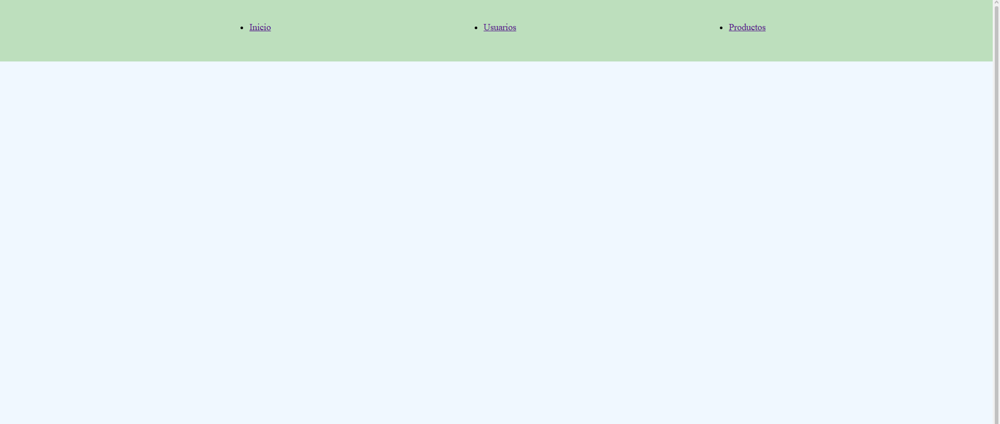
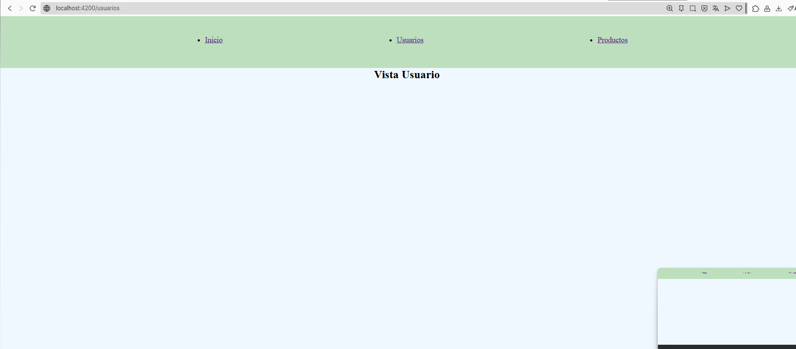
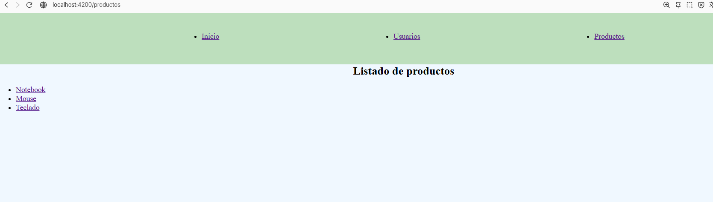
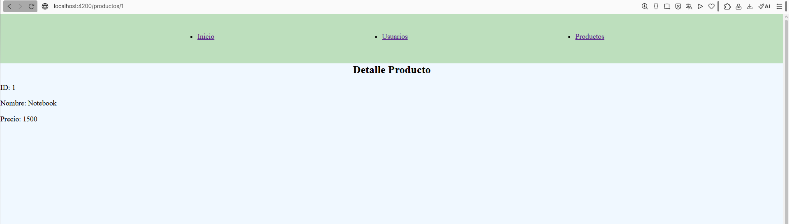

Proyecto donde se aplican conceptos como modulos,routing,rutas dinamicas,lazy loading,local storage.
Se crea module App,Productos y Usuarios,tambien se usan rutas dinamicas en el module productos.
Se usa routerlink para moverse entre paginas y router-outlet para el renderizado de cada componente.
Se guarda la direccion del componente utilizado con local storage y lo recuerda al refrescar.

Instrucciones para iniciar proyecto:

Npm intall para instalar node_modules
ng serve para iniciar proyecto

Screenshots pedidos:

Captura de pantalla de la app iniciada

Captura de pantalla de vista usuario:

Captura de pantalla de la vista detalle:

Captura de pantalla de la vista detalle dinamica con id:

